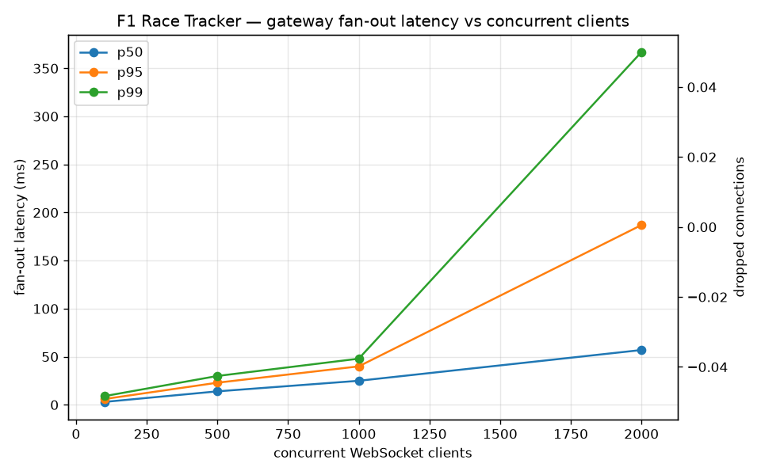

# F1 Race Tracker — Benchmark

**Headline:** A single gateway sustained **1,000** concurrent WebSocket viewers at 10 Hz with **p99 fan-out latency of 48 ms** and **zero dropped clients**, and kept climbing to ~2,000 viewers (≈19,900 frames/s) before latency knee'd — on one developer laptop.

Fan-out latency is the full journey of one frame: writer emit → Redis publish → gateway consume → in-memory hub fan-out → WebSocket write → client receive. It is measured client-side as `now − frame.T`, where `frame.T` is the publish wall-time stamped by the writer (`internal/feed/replay/play.go`).

## Method

- **What's under load:** one `gateway` process fanning out the `replay` session (Monza, 10 Hz) over WebSockets. Load is generated by `cmd/loadtest` (Go, one goroutine per connection).
- **Sweep:** 100, 500, 1,000, 2,000 concurrent clients; 30 s per level, 5 s dial ramp, 3 s warmup excluded from measurement.
- **Measured:** end-to-end fan-out latency percentiles (p50/p95/p99/max), aggregate frames/s received, dropped connections (the gateway's backpressure valve closing a slow client), and the gateway container's average CPU% / memory (`docker stats`).
- **Run on:** Intel Core i7-10750H (6 cores / 12 threads), 16 GB RAM, Windows 10, Docker Compose, 2026-06-22.

### Honest caveats

- **Single machine.** The load generator and the gateway share one box, so the harness steals CPU from the server. The real ceiling is therefore **higher** than the numbers below — this is a lower bound.
- **Same-host clock.** Client and server share a clock, which is *why* `now − T` latency is exact (no clock skew to correct for). Moving the harness to another host would require clock-sync handling.
- **One gateway.** No multi-gateway tier was built. The `/ws?session=<key>` hub registry + Redis pub/sub seam are what would make fan-out horizontal; scaling that out is future work.
- **Single-process connection ceiling.** Beyond ~2,000 connections from one load-generator process on this OS, new dials start failing (connect errors), so the top of the sweep is the *machine's* limit, not necessarily the *gateway's*. A level past that point was dropped because its clients can't all connect, which makes its numbers unrepresentative.

## Results

| clients | connected | frames/s | p50 | p95 | p99 | max | drops | CPU% | mem MB |
|--------:|----------:|---------:|----:|----:|----:|----:|------:|-----:|-------:|
| 100 | 100 | 1000 | 3 | 6 | 9 | 23 | 0 | 4.9 | 57.6 |
| 500 | 500 | 5000 | 14 | 23 | 30 | 37 | 0 | 24.3 | 46.0 |
| 1000 | 1000 | 10000 | 25 | 40 | 48 | 121 | 0 | 64.0 | 63.8 |
| 2000 | 1988 | 19895 | 57 | 187 | 367 | 1069 | 0 | 212.6 | 104.5 |

## What the curve shows

Latency stays flat and fast through 1,000 clients — p99 under 50 ms with a single core barely past half-busy (CPU 64%). The knee is at 2,000: p99 jumps roughly 8× to 367 ms and CPU spreads across multiple cores (212%) as the gateway works hardest. Notably, **degradation showed up as latency creep, not dropped connections** — `drops` stayed at 0 the whole way, so the gateway's backpressure valve never had to close a slow client; the cost of saturation was paid in milliseconds, not lost viewers. The next scaling step is the one the architecture already anticipates: a second gateway behind a load balancer, each subscribing to the same Redis pub/sub channel via the `/ws?session=<key>` seam — that splits the fan-out work and pushes the knee well past one box's single-process connection ceiling.

> Numbers are one dated snapshot from the dev laptop above, not a universal claim — re-running will produce slightly different figures. Reproduce with `docker compose up --build -d` then `python bench/run.py --levels 100,500,1000,2000`.
