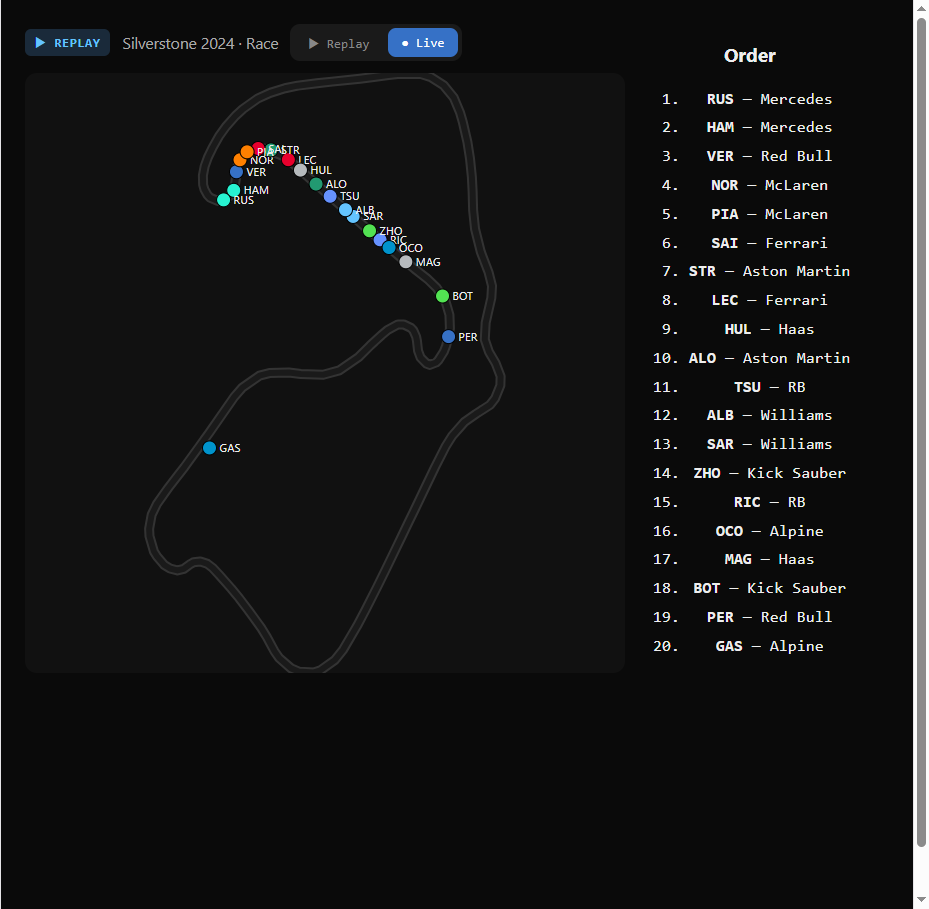
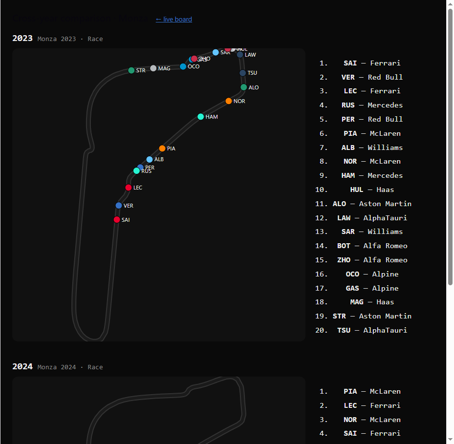
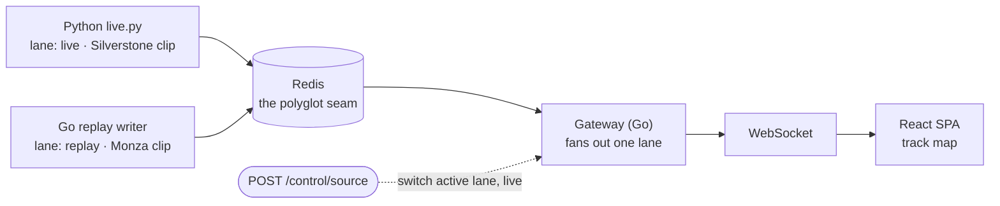

# F1 Race Tracker



A real-time F1 race tracker built as a polyglot stack — Python ingests position data, Redis is the seam, a Go gateway fans it out over WebSocket, and a React SPA renders an interactive track map updating at 10 Hz. The design is track-map-first: car positions on circuit are the primary view.

**One gateway sustained 1,000 concurrent WebSocket viewers at 10 Hz** — p99 fan-out latency of 48 ms, zero dropped clients, on a single laptop. See [BENCHMARKS.md](BENCHMARKS.md).

### What this demonstrates

- **A polyglot seam done right** — Python and Go publish byte-identical JSON to the same Redis keys; the gateway consumes either with zero code changes.
- **Live WebSocket fan-out at scale** — one in-memory hub pushes 10 Hz frames to a thousand viewers, with backpressure that sheds milliseconds rather than dropping clients.
- **Track-map-first design** — positions on circuit are the primary view, not an afterthought table.
- **Pit-wall timing tower** — beside the map the board shows a live timing tower with gaps/intervals, last lap, tyres, and sector times for every car; click any driver to open a per-car telemetry panel (speed, gear, throttle, brake, DRS) sourced from the same 10 Hz frame.

## Run it

```bash
docker compose up --build -d
```

Open [http://localhost:8080](http://localhost:8080).

The default view shows the Monza 2024 race clip (replay lane). Use the toggle at the top of the page to switch to the Silverstone 2024 clip streaming on the live lane.

### Cross-year comparison



Open <http://localhost:8080/#compare> for the side-by-side **Monza 2023 vs 2024** view — two maps fed by two `compare-*` lanes through the same gateway via `/ws?session=<key>`, kept in phase by the replay lanes' wall-clock-phased loop. Use the "Compare years →" link on the main board.

## Architecture — two lanes, one seam



Each lane writes to its own Redis keys (`snapshot:<session>` and `frames:<session>`) and never touches the other lane's keys. The gateway fans out exactly one lane at a time. Switching lanes is a live operation — no restart needed.

**Redis is the polyglot seam.** Python (`ingest/live.py`) and Go publish byte-identical JSON to the same key shapes. The gateway consumes either with zero code changes. The shared contract is defined in `internal/model/model.go`.

**Monotonic Rev.** Both the Go writer and the Python ingester read the stored snapshot's `rev` at startup and emit strictly above it. A restart or a source swap therefore never re-emits a Rev the gateway and clients already passed (which would silently freeze the board).

## Control endpoint

Switch the active source at runtime:

```
GET  /control/source
```
Returns `{"source":"replay"}` or `{"source":"live"}` — whichever lane the gateway is currently fanning out.

```
POST /control/source
Content-Type: application/json

{"source":"replay"}   # or "live"
```
Repoints the gateway at that lane, re-seeds every connected browser with that lane's snapshot (a wholesale replace), and starts streaming its frames. Only `"replay"` and `"live"` are valid values; anything else returns HTTP 400. Unknown HTTP method returns 405; switch failure returns 502.

The React UI toggle at the top of the page POSTs this endpoint. The active button is highlighted using the `session` field from the snapshot.

## Service layout (`docker-compose.yml`)

| Service  | Language | Role                                    | Default session |
|----------|----------|-----------------------------------------|-----------------|
| `redis`  | —        | The polyglot seam                       | —               |
| `replay` | Go       | Loops the Monza 2024 clip               | `replay`        |
| `live`   | Python   | Streams the Silverstone 2024 clip       | `live`          |
| `gateway`| Go       | Serves SPA + WebSocket, switchable lane | starts on `replay` |

## Further reading

- `ingest/` — how to bake a new circuit clip or run the live SignalR ingester
- `docs/F1_Race_Tracker_Tech_Scope.md` — technical architecture decisions
- `docs/F1_Race_Tracker_Product_Scope.md` — product scope and milestones
- `internal/model/model.go` — the shared Redis JSON contract
