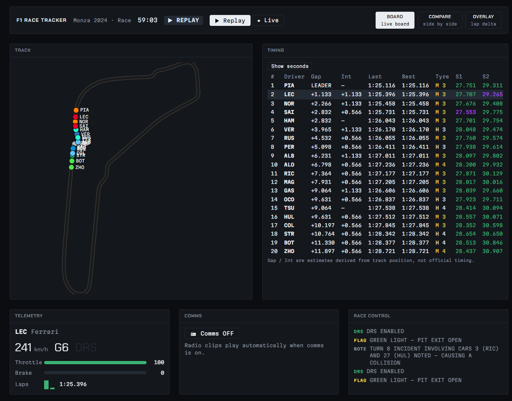
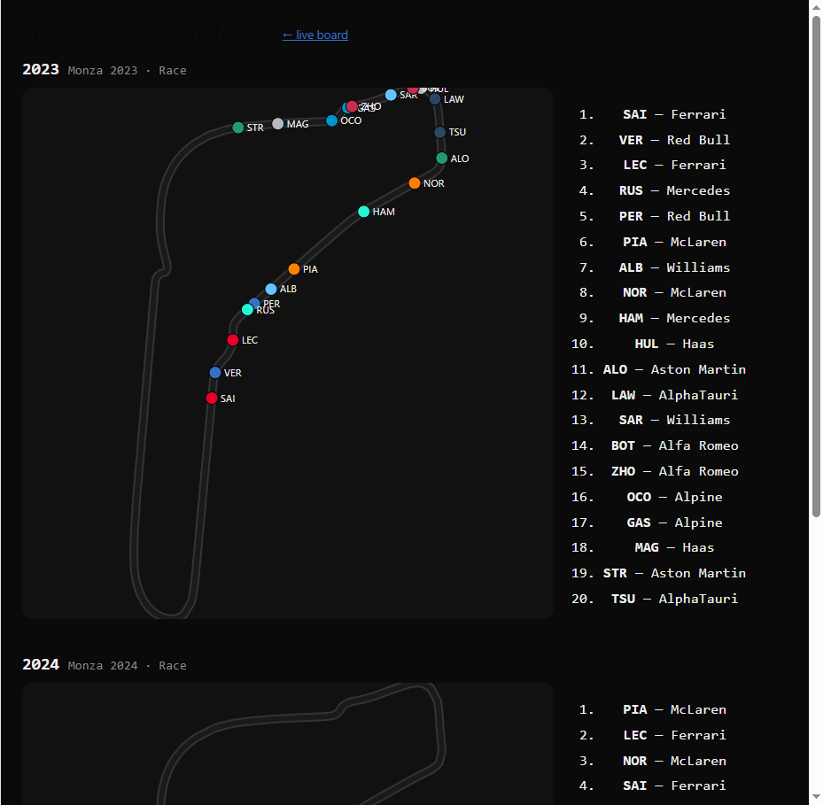
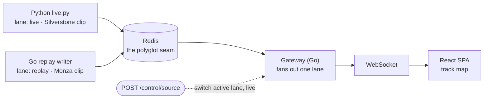

# F1 Race Tracker



An F1 race tracker that puts you on the pit wall — watch the cars on circuit, read the gaps, tyres, sector times and team radio like a race engineer, and dig into where a car is losing time. Built as a polyglot stack: Python ingests position data, Redis is the seam, a Go gateway fans it out over WebSocket, and a React SPA renders an interactive track map updating at 10 Hz. The design is track-map-first: car positions on circuit are the primary view.

**One gateway sustained 1,000 concurrent WebSocket viewers at 10 Hz** — p99 fan-out latency of 48 ms, zero dropped clients, on a single laptop. See [BENCHMARKS.md](BENCHMARKS.md).

### What you get on the pit wall

- **Track-map-first design** — positions on circuit are the primary view, not an afterthought table.
- **Pit-wall timing tower** — beside the map the board shows a live timing tower with gaps/intervals, last lap, tyres, and sector times for every car; a car in the pit lane shows `IN PIT` instead of a stale gap, and dims on the track map. Click any driver to open a per-car telemetry panel (speed, gear, throttle, brake, DRS, lap-time and gap trend sparklines) sourced from the same 10 Hz frame, with a "vs" picker for a side-by-side two-car telemetry compare.
- **Sector and lap-pace signal** — session-best and personal-best sector shading; click a row to set it as the reference car and every other row's sector delta switches to "how much am I losing to *them*, right now" instead of your own best.
- **Strategy timeline** — a full-race stint chart (compound + stint length per driver) baked once per session, so the pit-stop story — undercuts, tyre choice, stint length — reads at a glance instead of disappearing the moment a stop happens.
- **Weather** — track/air temperature and a rain badge in the status rail, baked from the session's real weather samples.
- **Team-radio comms layer** — a toggleable layer that auto-plays driver↔engineer radio in sync with the replay clock, with a now-playing banner and a short replayable history. The audio streams straight from F1's public URLs at play time — nothing is committed or downloaded — so the comms audio (only) needs network access; positions and timing stay fully offline from the committed clips. See [docs/adr/0003-team-radio-streamed-not-committed.md](docs/adr/0003-team-radio-streamed-not-committed.md).
- **Race control feed** — a timestamped, rolling log of real session messages (flags, safety car, investigations), baked from the session's actual race-control feed and replayed in sync alongside the timing tower.
- **Ghost overlay** — a cross-year lap comparison: this year's reference lap solid, last year's translucent, with a red/green delta bar showing exactly where a lap is won or lost round the circuit.

The product is judged first by whether it helps you understand how the car is performing. The engineering underneath — real-time, byte-identical across two languages — is what makes that possible at scale:

- **A polyglot seam done right** — Python and Go publish byte-identical JSON to the same Redis keys; the gateway consumes either with zero code changes.
- **Live WebSocket fan-out at scale** — one in-memory hub pushes 10 Hz frames to a thousand viewers, with backpressure that sheds milliseconds rather than dropping clients.

## Run it

```bash
docker compose up --build -d
```

Open [http://localhost:8080](http://localhost:8080).

The default view shows the Monza 2024 race clip (replay lane) — a mid-race window around laps 13–17 chosen to include real pit stops, so tyre stints, pit-lane status, and the strategy chart actually have something to show. Use the toggle at the top of the page to switch to the Silverstone 2024 clip on the "Live (demo)" lane — see [What's not done](#whats-not-done) for what "demo" means there. That clip's window (laps 25–28) sits in a real rain phase: expect the weather badge to show `RAIN` and cars to change from slicks to intermediates mid-clip.

### Cross-year comparison



Open <http://localhost:8080/#compare> for the side-by-side **Monza 2023 vs 2024** view — two maps fed by two `compare-*` lanes through the same gateway via `/ws?session=<key>`, kept in phase by the replay lanes' wall-clock-phased loop. Switch views any time with the **BOARD / COMPARE / OVERLAY** tabs in the status rail; OVERLAY (<http://localhost:8080/#ghost>) is the computed ghost-overlay lap delta.

### What's not done

The "Live (demo)" toggle is honestly labelled: it streams a second committed replay clip (Silverstone 2024) through Python to exercise the polyglot seam, not a real live-timing connection. True live ingestion (`ingest/live_signalr.py`) parses `TimingData`/`TimingAppData` for lap, gap/interval, and tyre fields alongside position, but every message shape is still `UNVERIFIED:` against a real session — see [docs/runbooks/live-verification.md](docs/runbooks/live-verification.md) for the checklist to run through and close out field-by-field the next time a live session is available.

Gap/Int in the timing tower remain best-effort estimates derived from track position, not official per-tick timing data (the tower says so). There's no per-rival two-car map overlay, and the stint chart shows the full baked plan rather than only what's happened so far in the replay window (noted in its own footnote).

## Architecture — two lanes, one seam


```mermaid
flowchart LR
    py["Python live.py<br/>lane: live · Silverstone clip"] --> redis[(Redis<br/>the polyglot seam)]
    go["Go replay writer<br/>lane: replay · Monza clip"] --> redis
    redis --> gw["Gateway (Go)<br/>fans out one lane"]
    gw --> ws[WebSocket] --> spa["React SPA<br/>track map"]
    ctl(["POST /control/source"]) -.->|switch active lane, live| gw
```

Each lane writes to its own Redis keys (`snapshot:<session>` and `frames:<session>`) and never touches the other lane's keys. The gateway fans out exactly one lane at a time. Switching lanes is a live operation — no restart needed.

**Redis is the polyglot seam.** Python (`ingest/live.py`) and Go publish byte-identical JSON to the same key shapes. The gateway consumes either with zero code changes. The shared contract is defined in `internal/model/model.go`.

**Monotonic Rev.** Both the Go writer and the Python ingester read the stored snapshot's `rev` at startup and emit strictly above it. A restart or a source swap therefore never re-emits a Rev the gateway and clients already passed (which would silently freeze the board).

## Control endpoint

Switch the active source at runtime:

```
GET  /control/source
```
Returns `{"source":"replay"}` or `{"source":"live"}` — whichever lane the gateway is currently fanning out.

```
POST /control/source
Content-Type: application/json

{"source":"replay"}   # or "live"
```
Repoints the gateway at that lane, re-seeds every connected browser with that lane's snapshot (a wholesale replace), and starts streaming its frames. Only `"replay"` and `"live"` are valid values; anything else returns HTTP 400. Unknown HTTP method returns 405; switch failure returns 502.

The React UI toggle at the top of the page POSTs this endpoint. The active button is highlighted using the `session` field from the snapshot.

## Service layout (`docker-compose.yml`)

| Service  | Language | Role                                    | Default session |
|----------|----------|-----------------------------------------|-----------------|
| `redis`  | —        | The polyglot seam                       | —               |
| `replay` | Go       | Loops the Monza 2024 clip               | `replay`        |
| `live`   | Python   | Streams the Silverstone 2024 clip       | `live`          |
| `gateway`| Go       | Serves SPA + WebSocket, switchable lane | starts on `replay` |

## Further reading

- `ingest/` — how to bake a new circuit clip or run the live SignalR ingester
- `docs/F1_Race_Tracker_Tech_Scope.md` — technical architecture decisions
- `docs/F1_Race_Tracker_Product_Scope.md` — product scope (as shipped)
- `docs/runbooks/live-verification.md` — checklist for verifying true-live ingestion against a real session
- `internal/model/model.go` — the shared Redis JSON contract
